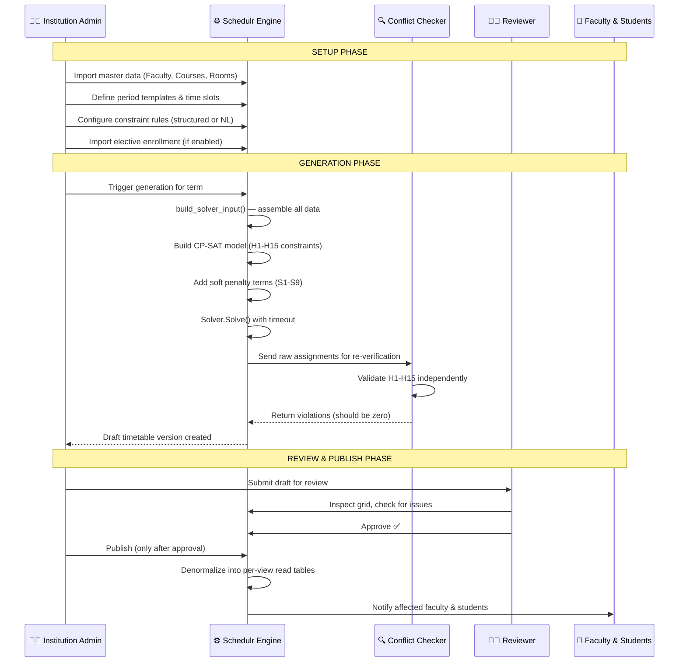
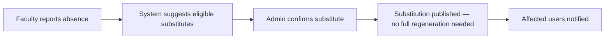
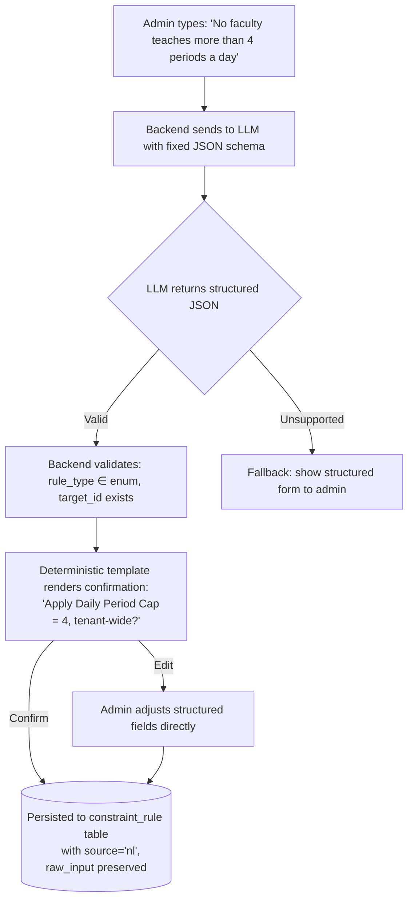
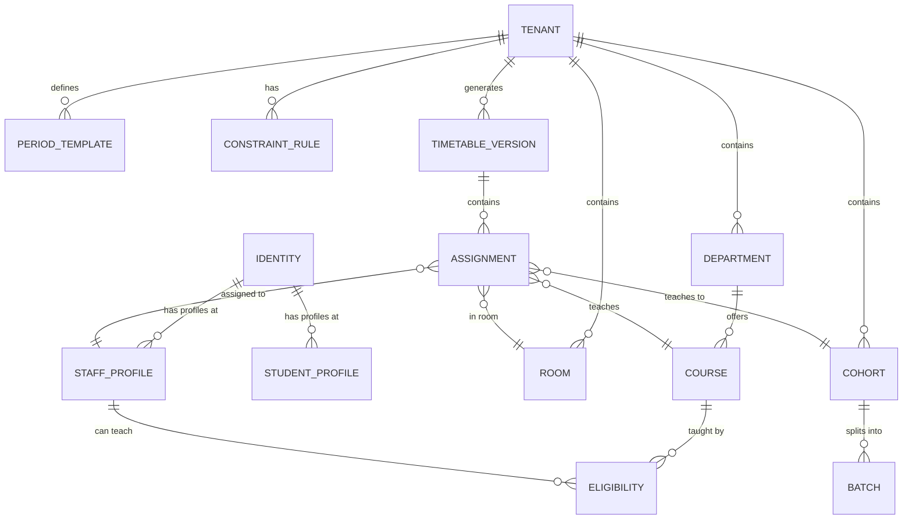

# 🗓 Schedulr — Smart Timetable Generator

> **PS1:** *"Develop an intelligent timetable generation system that creates conflict-free schedules while considering faculty availability, classrooms, laboratories, batches, electives, and scheduling constraints."*


---

## Table of Contents

- [The Big Idea](#-the-big-idea)
- [Key Features](#-key-features)
- [System Architecture](#-system-architecture)
- [How Data Flows: From Input to Timetable](#-how-data-flows-from-input-to-timetable)
- [Core Workflows](#-core-workflows)
- [The Constraint Engine](#-the-constraint-engine-the-heart-of-the-system)
- [Natural Language Rule Builder](#-natural-language-rule-builder)
- [Users and Role-Based Access Control](#-users-and-role-based-access-control)
- [Data Model Overview](#-data-model-overview)
- [API Contract](#-api-contract)
- [Getting Started](#-getting-started)
- [Using the Application](#-using-the-application-step-by-step)
- [Repository Structure](#-repository-structure)
- [Testing Strategy](#-testing-strategy)
- [Performance Targets](#-performance-targets)
- [Future Vision](#-future-vision)

---

## 💡 The Big Idea

A multi-tenant SaaS "scheduling brain." An institution — school, college, or university — describes its reality once: who can teach what to whom, which rooms and labs exist and what's in them, how cohorts split into batches and electives, and which rules must never be broken.

The system hands back a timetable that is **mathematically guaranteed conflict-free** across regular classes, lab batches, electives, and exams — not "probably correct," but **independently verified correct** — and keeps it correct as reality changes, without a human re-checking every cell by hand.

**The differentiator is not "it draws a grid."** It is that the grid is provably clash-free at a scale no human scheduler can hold in their head, and it's re-proved cheaply every time something changes.

---

## ✨ Key Features

| Feature | Description |
|---|---|
| **Mathematical Correctness** | Zero hard-constraint violations guaranteed by Google OR-Tools CP-SAT, then independently re-verified by a separate conflict checker. |
| **Multi-Tenant SaaS** | True data isolation via Postgres Row-Level Security (RLS). One Identity can span multiple tenants. |
| **Natural Language Rules** | Type "No faculty teaches more than 4 periods a day" — the system parses it, shows a deterministic confirmation card, and only applies it after explicit user approval. |
| **Elective & Lab Scheduling** | Cross-department electives, batch-split labs with shared resource capacity, and individualized student views. |
| **Mandatory Publish Workflow** | Enforced `Draft → Review → Publish` state machine. No silent auto-publish for any tenant. |
| **Exam Module** | Reuses the same solver to generate conflict-free exam schedules with invigilator assignments and room seating. |
| **Incremental Regeneration** | Warm-started via CP-SAT `AddHint()` — a small input change doesn't restart the full solve from scratch. |
| **Substitution Management** | Faculty absence tracking with automatic eligible substitute suggestions. |
| **Multi-View Reporting** | Cohort-wise, faculty-wise, room-wise, and individualized student views with utilization dashboards. |

---

## 🏗 System Architecture

The system follows a five-layer architecture. Requests flow top-down; results flow back up through a cache/read layer — **not back through the solver**.

```
┌─────────────────────────────────────────────────────────────────────┐
│                         CLIENT APPS                                 │
│             React + Tailwind (Vite) — Web Dashboard                 │
│      Admin/Committee views + Mobile-responsive Faculty/Student      │
└──────────────────────────┬──────────────────────────────────────────┘
                           │ REST API (JSON)
┌──────────────────────────▼──────────────────────────────────────────┐
│                     API GATEWAY (FastAPI)                            │
│   JWT Auth (Identity) → RBAC Check → Tenant Routing via RLS         │
│                                                                     │
│   Branches to: Keycloak/Auth0 (SSO) │ LLM API (NL Rules)           │
└──────────────────────────┬──────────────────────────────────────────┘
                           │
┌──────────────────────────▼──────────────────────────────────────────┐
│                      CORE SERVICES                                  │
│  Master Data │ Constraint Rule Engine │ NL Rule Parser (§20)        │
│  Generation Orchestrator │ Edit Service │ Reporting                  │
│  Schedule Mapper (CQRS denormalization) │ Notification Service      │
└──────────────────────────┬──────────────────────────────────────────┘
                           │ Async Job Queue
┌──────────────────────────▼──────────────────────────────────────────┐
│                     SOLVER WORKERS                                  │
│             Google OR-Tools CP-SAT Engine                           │
│   Builds constraints H1-H15 │ Minimizes soft penalty S1-S9         │
│   Independently deployable │ Testable without API/UI                │
└──────────────────────────┬──────────────────────────────────────────┘
                           │
┌──────────────────────────▼──────────────────────────────────────────┐
│                   DATA LAYER                                        │
│   PostgreSQL (Multi-tenant RLS)  │  Redis (Cache + Job Queue)       │
└─────────────────────────────────────────────────────────────────────┘
```

### Technology Stack

| Layer | Technology | Rationale |
|---|---|---|
| **Frontend** | React + TypeScript + TailwindCSS (Vite) | Fast to build the timetable grid and rule-builder confirm card. |
| **API** | Python (FastAPI), SQLAlchemy (Async), Alembic | Same language as the solver — no cross-language overhead for large constraint models. |
| **Solver** | OR-Tools CP-SAT (Python) | Fits this constraint class; supports solution hints for incremental regeneration. |
| **Rule Parsing** | LLM API call with fixed JSON output schema | Fastest path to NL rule builder without custom model training. |
| **Database** | PostgreSQL 15+ | Join-heavy relational model; native row-level security for tenant isolation. |
| **Job Queue / Cache** | Celery + Redis | Async handling for large solve jobs. |
| **Auth / SSO** | JWT + OAuth2 via Keycloak | Supports one Identity spanning multiple tenants. |
| **Containerization** | Docker Compose (demo) → Kubernetes (production) | Simple demo, explicit scaling story. |

---

## 🔄 How Data Flows: From Input to Timetable

This is the complete data processing pipeline — from the moment an admin enters data to when a student sees their schedule.

```
                              ADMIN INPUT
                                  │
            ┌─────────────────────┼─────────────────────┐
            │                     │                     │
     ┌──────▼──────┐     ┌───────▼───────┐     ┌───────▼───────┐
     │ Master Data │     │  Constraint   │     │  Enrollment   │
     │   Import    │     │    Rules      │     │    Import     │
     │             │     │               │     │               │
     │ • Faculty   │     │ • Structured  │     │ • Student →   │
     │ • Courses   │     │   form entry  │     │   Elective    │
     │ • Rooms     │     │ • Natural     │     │   mappings    │
     │ • Cohorts   │     │   language    │     │               │
     │ • Batches   │     │   (LLM parse  │     │               │
     │ • Periods   │     │   + confirm)  │     │               │
     └──────┬──────┘     └───────┬───────┘     └───────┬───────┘
            │                    │                     │
            └────────────────────┼─────────────────────┘
                                 │
                    ┌────────────▼────────────┐
                    │    GENERATION SERVICE   │
                    │                         │
                    │  1. build_solver_input() │
                    │     Reads all master     │
                    │     data + rules from DB │
                    │                         │
                    │  2. Creates CP-SAT      │
                    │     variables:           │
                    │     assign[f,c,k,r,s]    │
                    │     ∈ {0,1}              │
                    │     (only for eligible   │
                    │      f,c,k combos and    │
                    │      compatible c,r      │
                    │      room types)         │
                    │                         │
                    │  3. Adds hard constraint │
                    │     functions:           │
                    │     build_h1() → H15()   │
                    │                         │
                    │  4. Adds soft penalty    │
                    │     terms: S1 → S9       │
                    │     (weighted objective) │
                    │                         │
                    │  5. Solver.Solve()       │
                    │     with timeout         │
                    └────────────┬─────────────┘
                                 │
                    ┌────────────▼────────────┐
                    │  CONFLICT CHECKER       │
                    │  (Independent Module)    │
                    │                         │
                    │  Re-validates H1-H15    │
                    │  against solver output  │
                    │  using SEPARATE code    │
                    │  path (not the solver's │
                    │  own constraint funcs)  │
                    └────────────┬─────────────┘
                                 │
                    ┌────────────▼────────────┐
                    │  TIMETABLE VERSION      │
                    │  (state: DRAFT)          │
                    │                         │
                    │  Stored as Assignment   │
                    │  rows in the DB:        │
                    │  {version_id, faculty,  │
                    │   course, cohort, room, │
                    │   slot_start, slot_span} │
                    └────────────┬─────────────┘
                                 │
               ┌─────────────────┼──────────────────┐
               │                 │                  │
        ┌──────▼──────┐  ┌──────▼──────┐  ┌────────▼────────┐
        │   REVIEW    │  │   APPROVE   │  │    PUBLISH      │
        │  (Mandatory)│  │  (Reviewer) │  │  (Admin only,   │
        │             │  │             │  │   after approve) │
        │  Grid view  │  │  Explicit   │  │                 │
        │  + conflict │  │  action     │  │  Denormalizes   │
        │  overlay    │  │  required   │  │  into per-view  │
        │             │  │             │  │  read tables    │
        └─────────────┘  └─────────────┘  └────────┬────────┘
                                                   │
                              ┌─────────────────────┼─────────────────┐
                              │                     │                 │
                       ┌──────▼──────┐      ┌───────▼──────┐  ┌──────▼──────┐
                       │  Faculty    │      │   Student    │  │   Room      │
                       │  Schedule   │      │   Schedule   │  │   Schedule  │
                       │  View       │      │   View       │  │   View      │
                       │ (personal)  │      │ (individual, │  │             │
                       │             │      │  elective-   │  │             │
                       │             │      │  aware)      │  │             │
                       └─────────────┘      └──────────────┘  └─────────────┘
```

### The CP-SAT Decision Variable

The core of the solver is a single binary decision variable:

```
assign[f, c, k, r, s] ∈ {0, 1}
```

Where:
- **f** = staff profile (faculty)
- **c** = course
- **k** = cohort
- **r** = room
- **s** = time slot (block starting position)

**Meaning:** "Faculty `f` teaches course `c` to cohort `k` in room `r`, starting at slot `s`."

Variables are **only created** for:
- `(f, c, k)` triples present in the **eligibility** table → enforces H5 by construction
- `(c, r)` pairs where the room type matches the course requirement → enforces H9 by construction

This means the solver never even considers infeasible assignments — they don't exist as variables.

---

## 🔁 Core Workflows

### Workflow 1: The Once-Per-Term Cycle



### Workflow 2: Day-to-Day Operations



### Workflow 3: Exam Scheduling (Parallel Cycle)

The exam module follows the **identical** `Generate → Review → Approve → Publish` cycle, reusing the same rooms, cohorts, and faculty data, with its own constraint set (H12–H14, S9) and its own outputs (seating charts, invigilator rosters).

---

## 🧠 The Constraint Engine — The Heart of the System

Everything else in the system is scaffolding around these two lists. These are the actual product.

### Hard Constraints (Zero Violations — Always)

Every single one of these is enforced both by the solver **and** independently re-verified by a separate conflict checker (a completely different code path):

| ID | Constraint | CP-SAT Formulation |
|---|---|---|
| **H1** | No faculty double-booked in the same slot | ∀ f,s: Σ assign[f,c,k,r,s] ≤ 1 |
| **H2** | No cohort double-booked in the same slot | ∀ k,s: Σ assign[f,c,k,r,s] ≤ 1 |
| **H3** | No room double-booked in the same slot | ∀ r,s: Σ assign[f,c,k,r,s] ≤ 1 |
| **H4** | Faculty not scheduled in unavailable/admin blocks | assign[f,*,*,*,s] = 0 for blocked slots |
| **H5** | Faculty only assigned to eligible (course, cohort) pairs | Variables only created for eligible combos |
| **H6** | Required weekly hours per (course, cohort) exactly met | Σ assign = required_hours[c,k] |
| **H7** | Slots only within valid period range for that day/shift | Variables only created for valid ranges |
| **H8** | Faculty weekly/daily workload cap never exceeded | Σ assign ≤ cap[f], per week and per day |
| **H9** | Room equipment matches course requirements | Variables only created for matching pairs |
| **H10** | Shared-resource capacity across batch-splits never exceeded | Lab-type rooms: Σ assign ≤ room count |
| **H11** | No student double-booking across their elective combination | Cross-referenced against enrollment records |
| **H12** | *(Exam)* No student has two overlapping exam sessions | Same as H11, applied to exam schedule |
| **H13** | *(Exam)* Exam room seating capacity never exceeded | Enrollment count ≤ room capacity |
| **H14** | *(Exam)* Invigilator not double-booked; within workload cap | Same as H1/H8, applied to invigilators |
| **H15** | Block courses scheduled as N consecutive periods, same room/day | Implies occupancy s..s+n−1 in all sums |

### Soft Constraints (Weighted Objective Terms — Optimized)

These are penalty terms added to the objective function. The solver minimizes total penalty while staying within the hard-constraint-feasible space:

| ID | Constraint | Optimization Target |
|---|---|---|
| **S1** | Minimize idle gaps for faculty and students | Gap penalty per person per day |
| **S2** | Balance faculty load evenly across the week | Variance in daily teaching load |
| **S3** | Distribute a course's weekly hours across different days | Penalty for same-day stacking |
| **S4** | Prefer core/high-focus subjects earlier in the day | Slot-position weighting |
| **S5** | Minimize same-course-twice-in-one-day | Penalty for double-scheduling |
| **S6** | Prefer parallel batch sessions aligned to same slot | Alignment bonus |
| **S7** | Maximize room-utilization efficiency | Unused-capacity penalty |
| **S8** | Respect individual faculty time-of-day preferences | Preference mismatch penalty |
| **S9** | *(Exam)* Spread student exams evenly; minimize consecutive-day exams | Gap-day bonus |

---

## 🗣 Natural Language Rule Builder

Instead of forcing admins to understand constraint programming, Schedulr allows natural English inputs:



**Critical design principle:** The confirmation text shown to the admin is **template-rendered from the structured object** — it is **never re-generated by the LLM**. This guarantees what is shown always matches what gets stored.

### Supported Rule Types

| Rule Type | Example Phrasing |
|---|---|
| `max_periods_per_day` | "No faculty teaches more than 4 periods a day" |
| `max_periods_per_week` | "Faculty should teach at most 20 periods a week" |
| `min_gap_between_periods` | "Give faculty at least one free period between teaching blocks" |
| `no_consecutive_same_course` | "Don't put the same subject back-to-back for a class" |
| `preferred_time_of_day` | "Science should be scheduled in the morning" |
| `balance_load_across_week` | "Spread faculty load evenly across the week" |
| `exam_min_gap_days` | "Give students at least one day between exams" |

---

## 👥 Users and Role-Based Access Control

RBAC is enforced at the API layer via FastAPI dependency injection. Every endpoint checks the caller's role against this matrix:

| Role | Permissions |
|---|---|
| **Platform Super Admin** | Onboard new tenants. Platform-wide access. |
| **Institution Admin** | Full CRUD on master data, rules, generation, manual editing, publish (after reviewer approval). |
| **Department Head** | Scoped CRUD, generation, manual editing within own department. |
| **Reviewer** | Reviews and approves draft timetables. Cannot trigger generation or publish. |
| **Faculty** | Read-only personal schedule. Reports absence. |
| **Student** | Read-only individualized schedule (reflects personal electives). |

### Multi-Tenant Identity

One person (Identity) can hold staff profiles at multiple institutions/tenants. The JWT carries only `identity_id` — never `tenant_id`. Tenant context is resolved per-request from the URL path parameter, and enforced at the database layer via:

```sql
SET LOCAL app.tenant_id = '<tenantId>';
CREATE POLICY tenant_isolation ON <table>
  USING (tenant_id = current_setting('app.tenant_id')::uuid);
```

---

## 📊 Data Model Overview



### Key Tables

| Table | Purpose |
|---|---|
| `identity` | Person-level login, tenant-independent |
| `tenant` | Institution with isolated config, timezone, enabled modules |
| `staff_profile` | Tenant-scoped record linking identity → eligibility, workload caps, roles |
| `course` | Core/elective/lab with hours_per_week, block_size, equipment requirements |
| `cohort` | Fixed group (school) or elective-derived group (college) |
| `room` | Classroom/lab with capacity, equipment_tags, accessibility flag |
| `constraint_rule` | Hard/soft rule with type, scope, weight, and source (structured or NL) |
| `assignment` | Solver output: faculty + course + cohort + room + slot (the write model) |
| `timetable_version` | Draft → under_review → published → archived (the state machine) |
| `published_schedule` | Denormalized read model for fast view queries (CQRS-lite) |

---

## 🔌 API Contract

All endpoints live under `/api/v1/`. All list endpoints use cursor-based pagination.

| Method & Path | Purpose |
|---|---|
| `POST /tenants` | Onboard new tenant (platform operator only) |
| `POST /tenants/{id}/import/enrollment` | Import pre-resolved elective enrollment |
| `POST /tenants/{id}/rules` | Create a rule via structured fields |
| `POST /tenants/{id}/rules/parse` | Parse NL text → returns structured rule for confirmation |
| `POST /tenants/{id}/rules/{ruleId}/confirm` | Persist a confirmed NL-parsed rule |
| `POST /tenants/{id}/timetables/generate` | Trigger timetable generation |
| `GET /tenants/{id}/timetables/{versionId}` | Fetch a timetable version |
| `POST /tenants/{id}/timetables/{versionId}/approve` | Mandatory reviewer approval |
| `POST /tenants/{id}/timetables/{versionId}/publish` | Publish (blocked until approved) |
| `POST /tenants/{id}/exams/generate` | Trigger exam timetable generation |
| `GET /tenants/{id}/reports/verification` | Load verification report |
| `GET /me/tenants` | List all tenants for the current identity |

### Error Envelope (consistent everywhere)

```json
{
  "error": {
    "code": "VALIDATION_ERROR | NOT_FOUND | FORBIDDEN | CONFLICT | INFEASIBLE_CONFIGURATION",
    "message": "Human-readable explanation naming specific entities",
    "details": {}
  }
}
```

---

## 🚀 Getting Started

### Prerequisites

- Docker & Docker Compose
- Python 3.11+
- Node.js 18+

### 1. Start Backing Services

```bash
docker compose up -d
# Starts: PostgreSQL (port 5433), Redis (port 6379), Keycloak (port 8080)
```

### 2. Set Up Environment

```bash
cp .env.example .env
# Edit .env and set your OPENAI_API_KEY (required for NL rule builder)
```

### 3. API Service

```bash
cd services/api
python -m venv .venv
source .venv/bin/activate
pip install -e ".[dev]"

# Run migrations
alembic upgrade head

# Seed demo data (40+ cohorts, 100+ faculty, electives, labs, exams)
python scripts/seed_demo.py

# Start the server
uvicorn app.main:app --reload --port 8000
```

### 4. Frontend

```bash
cd apps/web
npm install
npm run dev
# Opens at http://localhost:5173
```

### 5. Solver Tests (Optional)

```bash
cd services/solver
pip install -e ".[dev]"
pytest tests/ -v
```

---

## 📖 Using the Application: Step by Step

### Step 1: Login

Navigate to `http://localhost:5173`. Use one of the demo accounts:

| Email | Role | What you can do |
|---|---|---|
| `admin@timetable.local` | Admin | Full access: setup, generate, publish |
| `reviewer@timetable.local` | Reviewer | Review and approve drafts |
| `faculty@timetable.local` | Faculty | View personal schedule |
| `student@timetable.local` | Student | View individualized schedule |

*(Any password works in demo mode)*

### Step 2: Setup (Admin)

Use the **Setup Wizard** to configure:
1. **Institution profile** — name, type (school/college/university)
2. **Campus structure** — multi-campus support
3. **Module toggles** — enable/disable electives and exam modules

### Step 3: Master Data (Admin)

Use the sidebar navigation to manage:
- **Departments** — organizational units
- **Courses** — core, elective, or lab courses with hours/week and block_size
- **Faculty** — staff profiles with workload caps and eligibility
- **Rooms** — classrooms and labs with capacity and equipment tags

### Step 4: Constraint Rules (Admin)

Navigate to **Rules** to configure scheduling constraints:
- Use the **structured form** for precise control
- Or type a **natural language rule** and confirm the parsed result

### Step 5: Generate (Admin)

Click **Generate Timetable** to trigger the CP-SAT solver. The system will:
1. Assemble all master data and rules
2. Build the constraint model
3. Solve for an optimal assignment
4. Independently verify all hard constraints
5. Create a Draft timetable version

### Step 6: Review & Approve (Reviewer)

Log in as a reviewer to inspect the draft grid. Click **Approve** to authorize publishing.

### Step 7: Publish (Admin)

Once approved, the admin can **Publish** the timetable. This denormalizes data into per-view read tables and notifies affected users.

### Step 8: View Schedules (Faculty / Students)

Faculty and students see only their **personalized** schedules, reflecting their specific courses, electives, and batches.

---

## 📁 Repository Structure

```
smart-timetable-generator/
├── AGENTS.md                        # Build companion for AI coding agents
├── README.md                        # This file
├── docker-compose.yml               # Postgres + Redis + Keycloak
├── .env.example                     # Environment variable template
│
├── docs/
│   └── PROJECT_SPEC.md              # Full 800-line specification (source of truth)
│
├── apps/
│   └── web/                         # React + Tailwind (Vite) Frontend
│       └── src/
│           ├── api/
│           │   └── client.ts        # Typed API client with all endpoint wrappers
│           ├── features/
│           │   ├── setup-wizard/    # Institution onboarding flow
│           │   ├── rule-builder/    # NL + structured constraint authoring
│           │   ├── generation-review/  # Timetable grid with conflict overlay
│           │   ├── publish/         # Publish confirmation page
│           │   ├── faculty-student-view/  # Personalized read-only views
│           │   ├── exam-module/     # Exam generation and views
│           │   └── timetable-grid/  # Reusable grid component
│           ├── components/
│           │   └── layout/          # Sidebar, MainLayout shell
│           ├── lib/
│           │   └── TenantContext.tsx # React context for tenant routing
│           └── pages/               # 12 top-level route pages
│
├── services/
│   ├── api/                         # FastAPI Backend
│   │   ├── app/
│   │   │   ├── core/
│   │   │   │   ├── auth.py          # JWT verification + demo token bypass
│   │   │   │   └── tenant_context.py  # RLS session variable injection
│   │   │   ├── models/              # SQLAlchemy ORM (1:1 with spec §17/§28)
│   │   │   ├── schemas/             # Pydantic request/response models
│   │   │   ├── routers/             # 16 API route modules
│   │   │   ├── services/            # Business logic (generation, editing, notifications)
│   │   │   ├── rbac/
│   │   │   │   └── dependencies.py  # FastAPI dependency for role checking
│   │   │   └── rule_parser/
│   │   │       ├── llm_client.py    # OpenAI API integration
│   │   │       ├── validator.py     # Schema + semantic validation
│   │   │       └── templater.py     # Deterministic confirmation renderer
│   │   ├── alembic/                 # Database migrations
│   │   ├── scripts/
│   │   │   └── seed_demo.py         # Seeds 40+ cohorts, 100+ faculty
│   │   └── tests/                   # API integration tests
│   │
│   └── solver/                      # OR-Tools CP-SAT (independently deployable)
│       ├── solver/
│       │   ├── data_types.py        # SolverInput, SolverAssignment dataclasses
│       │   ├── model.py             # build_h1() through build_h15() + solve()
│       │   ├── objective.py         # S1-S9 weighted penalty terms
│       │   ├── conflict_checker.py  # Independent H1-H15 re-verification
│       │   └── rule_compiler.py     # constraint_rule → solver parameter mapping
│       └── tests/
│           └── constraints/         # 18 test files: one per H-code + extras
│
└── infra/
    ├── keycloak/                    # Realm export for OIDC setup
    └── docker/                      # Dockerfiles
```

---

## 🧪 Testing Strategy

The solver is tested with a **violate-then-assert** pattern: each test constructs a synthetic case designed to violate a specific constraint if it weren't enforced, then asserts the solver's output satisfies it:

```
services/solver/tests/constraints/
├── test_h1_no_faculty_double_booking.py
├── test_h2_no_cohort_double_booking.py
├── test_h3_no_room_double_booking.py
├── test_h4_faculty_unavailable_blocks.py
├── test_h5_faculty_eligibility.py
├── test_h6_hours_match_required.py
├── test_h7_valid_period_range.py
├── test_h8_workload_cap.py
├── test_h9_room_type_match.py
├── test_h10_shared_lab_capacity.py
├── test_h11_student_double_booking.py
├── test_h12_student_exam_overlap.py
├── test_h13_exam_room_capacity.py
├── test_h14_invigilator_double_booking.py
├── test_locked_assignments.py
├── test_rule_compiler.py
└── test_soft_overrides.py
```

Run all solver tests:
```bash
cd services/solver && pytest tests/ -v
```

Run API tests:
```bash
cd services/api && pytest tests/ -v
```

---

## ⚡ Performance Targets

| Tier | Profile | Full Solve | Incremental Regen |
|---|---|---|---|
| **Small** (single school) | ≤ 10 sections, ≤ 20 faculty | ≤ 30 seconds | ≤ 3 seconds |
| **Medium** (college, demo) | ≥ 40 sections, ≥ 100 faculty | ≤ 3 minutes | ≤ 15 seconds |
| **Large** (university) | ≥ 200 sections, ≥ 500 faculty | ≤ 15 minutes | ≤ 60 seconds |

---

## 🔮 Future Vision

### Near-Term Enhancements

| Feature | Description |
|---|---|
| **Drag-and-Drop Manual Editing** | Live conflict re-validation overlay on the timetable grid with optimistic concurrency guards. |
| **PDF/Excel/ICS Export** | Export any timetable view to downloadable formats for offline use and calendar sync. |
| **CSV Bulk Import UI** | File-upload components in the Setup Wizard wired to the backend import endpoints. |
| **Notification Inbox** | In-app notification center with configurable delivery channels (Email / Push / SMS). |
| **Department-wise Views** | Aggregate scheduling view filtered by department for department heads. |

### Medium-Term Roadmap

| Feature | Description |
|---|---|
| **Elective Preference Collection** | Let students submit course preferences; use historical demand data to inform section creation. |
| **Elective Demand Forecasting** | Predict enrollment patterns from historical preference data to optimize section sizes. |
| **What-If Simulation UI** | Visual comparison of "what would happen if I changed X?" without committing changes. |
| **Schema-Per-Tenant Isolation** | Promote large tenants to dedicated Postgres schemas for stronger physical isolation. |
| **Analytics Dashboards** | Deep-dive into room utilization, faculty workload distribution, and scheduling efficiency metrics. |

### Long-Term Vision

| Feature | Description |
|---|---|
| **Hostel & Mess Scheduling** | Reuse the same constraint-engine architecture for adjacent institutional scheduling problems. |
| **Mobile Native Apps** | Dedicated iOS/Android apps for faculty and students with push notifications. |
| **Multi-Language UI** | Full i18n support for non-English institutions. |
| **AI-Powered Suggestions** | Use historical scheduling data to proactively suggest constraint adjustments and optimal configurations. |
| **Kubernetes Production Deployment** | Horizontal scaling with tenant-aware worker pools routing solve jobs by institution size. |

---

## 📄 Documentation

| Document | Purpose |
|---|---|
| [PROJECT_SPEC.md](docs/PROJECT_SPEC.md) | The complete 800-line specification — the single source of truth |
| [AGENTS.md](AGENTS.md) | Build companion for AI coding agents — distilled spec reference |

---

## 📜 License

This project is developed for hackathon submission and academic evaluation. All rights reserved.
